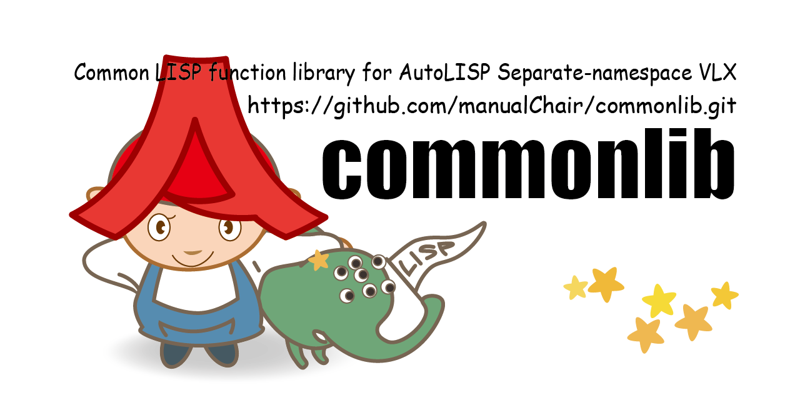

AutoLISP 独自の名前空間 VLX のための Common LISP 関数ライブラリ

# イントロダクション

このライブラリは、Common LISP の標準関数を AutoLISP で使えるように作成されたものです。AutoLISP の標準の関数群は最低限に必要なものに限られているため、プログラムを実際に書くには、たびたび基礎的な関数を自作しなければなりません。このライブラリはその圧倒的な関数の不足を補いプログラミング作業を効率的にします。ANSI にまでになっている Common LISP 仕様の関数は機能が洗練され有用なものです。

ライブラリの関数の仕様は、Common LISP のそれに極力準じるようにしています。単純な関数以外にも、構造体や配列といった Common LISP や他の言語で当たり前のものを AutoLISP で手軽に使用できるようにする言語レベルの拡張も含まれます。しかし、関数の種類は AutoCAD で使用する可能性のあるものに限りましたので AutoLISP を完全な Common LISP にするものではありません。また、言語仕様的にも再現不可能なものもあります。また、他の LISP から仕様を AutoLISP に持ってきたことから明らかなように、本ライブラリには AutoCAD をコントロールしたり図形を作図させたりするようなものは含まれません。

一方で、Common LISP の標準関数の実装に当たって、一部、AutoLISP で使えたら便利そうだと思ったものは機能が拡張されています。さらにライブラリには Common LISP の標準関数以外に有用性の高そうな独自の関数も含めました。基本的なベクトルと行列にかかわる線形代数の関数も追加しています。

本ライブラリの関数は単純なものから複雑なものへと依存関係を持っています。これらの関数は load 関数を拡張した独自のライブラリ用の include 関数を用いてロードします。関数の依存関係は利用するだけなら意識する必要はありませんが、どのような関数がロードされるのか把握することは困難です。そのため、最終的にこれらのライブラリ関数を使用して作成したプログラムは、AutoCAD ユーザーの既存の AutoLISP 実行環境とは干渉しない**独自の名前空間 VLX アプリケーション**として仕上げられることを前提としています。

最後に加えて、さまざまな理由から、**ライブラリの仕様が今後変わる可能性がある**ことをお断りしておきます。

# ライセンスについて

本ライブラリで提供される関数のソースコードについては、**MIT ライセンス**とします。MIT ライセンスはオープンソースソフトウェアのライセンスの一つで、制約が少ししかないものです。

MIT ライセンスのあらましを本件にあわせて意訳すると以下の通りです。
* 無保証です！
* 本ライブラリのソースコードは誰でも無料で使用できます。商用を含めて、自由にソースコードの配布や変更を行うこと、これ使ったプログラムの作成ができます。
* 本ライブラリのソースコードの再配布や変更を行う場合、これらに既に含まれている下記の著作権表示は消してはいけません。また、このライブラリを使用して作成したあなたのプログラムを配布しようとするときの著作権表示には、同じく下記の著作権表示の三行を、同梱するライセンス表示用の別ファイルなど適当な、しかし確認できるところに明示してください。
```
Copyright (c) 20xx manual chair japan
Released under the MIT license
https://opensource.org/licenses/mit-license.php
```

# ライブラリの使用法

本ライブラリの関数を使用するには load 関数を拡張した独自の include 関数を用います。include 関数については、以下の説明を参照してください。

https://github.com/manualChair/include.git

各ライブラリ関数のソースコードの一行目には、この関数を使用するための include 関数を使ったステートメントがコメントアウトして書かれています。これをコピーアンドペーストして、あたたのプログラムにライブラリ関数を取り込んでください。

# ライブラリ関数のリファレンス

下記のサイトを参照してください。

http://manualchair.html.xdomain.jp/commonlib/jp/index.html

# ライブラリの概要

## フォルダ構成

ライブラリのソースコードはカテゴリー別にフォルダに分けられています。このフォルダは Paul Graham 著の ANSI Common Lisp （洋書）の巻末のリファレンスのセクションに準じるようにしています。追加で「common」フォルダと「linear_algebra」フォルダがあり、「common」フォルダはライブラリに共通して使用される独自の関数を、「linear_algebra」フォルダは Common LISP には無い線形代数関係の関数をおさめています。

## 名前空間

関数の命名は、Common LISP に準じています。そして最終的には【独自の名前空間 VLX アプリケーション】で使用される想定で書かれています。そのため、vl- vla- といった AutoLISP でよくみられる接頭辞は付けない形式で、関数の真の名前が最初に来ます。このことから、あなたが好んで使うシンボル名や関数名と**衝突を起こす可能性**は排除できません。慎重にシンボル名を吟味してください。

ライブラリの関数は、その関数が独自のサブ関数を必要とする場合、メインとなる関数名の後に「:」（コロン）を挟んだ名前で定義されています。

メイン関数	| サブ関数
---|---
FOO	|FOO:SUB など

このような形式となっているサブ関数をソースコード内で見かけても、どこからでもこの関数へのアクセスは可能ですが正常に動かないのが常です。**メインの関数からアクセスする**ようにしてください。

また、あるデータの型に対して対応する関数が複数ある場合では、メイン関数でも「:」を挟んだ関数名としているものがあります。例えばベクトルに関する vector:add 関数や vector:sub 関数などです。これらはどこからでも呼び出すことはできます。

データ型	|呼出し可能関数
---|---
vector	|vector:add vector:sub ...

これらは名前空間を分けるために使用している記法です。いずれにしても関数リファレンスに書かれているものならばメイン関数でありどこからでも呼び出せますが、そうでないものはサブ関数で不用意に呼びだしてはいけません。

## 1ファイル1関数の原則

原則、一つのファイルに一つの関数（一つの機能）で構成されています。この場合、サブ関数はメインの関数に含まれると考え、一つのファイルに一つの関数定義という意味ではありません。例外的に、セットで使うのが明らかなものは、一つのファイルに複数のメイン関数が定義されています。

ファイル名は、関数名と同じにすることを原則としています。ただし一部の関数においてはファイル名に使えない記号で、「:」（コロン）は「_」（アンダーバー）に置き換え、また、不等号記号「>」は脱落させています。

関数名	|ファイル名
---|---
matrix:Inverse-Cofactor	|matrix_Inverse-Cofactor.LSP
string->list	|string-list.LSP

「_」（アンダーバー）で始まるファイル名に書かれている関数は、メイン関数から呼ばれるサブ関数だけを定義したものです。複数のメイン関数（複数のファイル）から参照されていたり関数が巨大だったりした場合に別ファイルとされています。

## 省略可能な引数

Common LISP の関数は引数を省略可能なものと定義することができますが、AutoLISP で新たに定義する関数はオプション的な引数を定義できないので、常にすべての引数を指定する必要があります。そのためコードが助長になる場合がありますが、そのオプションの引数を使わない場合は nil を渡せば無視されることを原則としています。

## シーケンス

AutoLISP から Common LISP の関数を見た場合、AutoLISP には無い「シーケンス」という新たな概念を理解する必要があります。シーケンスとは、一次元のデータの集合のことです。直接的なイメージは一次元の配列、一次元の LISP のリストといったものですが、その中には文字列も含まれます。文字列も文字コードが連なった一次元の配列だからです。そして、さらにややこしくなりますが、Common LISP ではシンボル名も（大文字の）文字列のように扱えます。そこで Common LISP ではシンボル名もシーケンスと考えてよいかというと、そうでは無いようですが、ややこしいので、ここでは文字列に変換可能なもの、つまりシンボル名もシーケンスとして扱います。

Common LISP にはシーケンスを関数の引数で受け付けるグループがあります。今回 AutoLISP 上に実装するにあたっても、シーケンスを扱える関数はシーケンスを受け付けるようにしています。つまり、引数にリストを渡すところで文字列やシンボル名を渡すことも可能ですし逆に文字列が期待されるところにリストを渡すこともできます。これらの関数は「strings」フォルダと「sequences」フォルダに含まれています。一方でリストのみを対象としたカテゴリーがあり、「conses」フォルダにおさめられています。

これら引数で与えられたデータは、結局は関数の内部でリストに変換されて処理されています。シーケンスと称して結局はどちらもリストで処理する「strings」フォルダと「sequences」フォルダのカテゴリーの違いは、カテゴリー strings は文字列を処理する目的のもので引数がリストとしても文字列に変換可能なもの、カテゴリー sequences は汎用的な一次元のリストを処理する目的のもので、引数は文字列や文字列から変換されたリスト以外に、一般的な一次元とみなしたリストも受け付けます。なお、リストを扱うカテゴリー conses の関数は、一次元以外のリストでも扱えるさらに汎用のものになります。

文字列と文字列から変換されたリストのことを、本ライブラリではでは文字列と区別して「文字列型」と呼びます。

各フォルダのカテゴリーの違いをまとめると次のとおりです。リストや文字列を扱いたい場合、これらのカテゴリーから関数を探すとだいたいの目的の関数が見つかります。

フォルダ	|対象	|説明
---|---|---
conses	|リスト	|多次元のリストを含めた、広い形式のリストを扱う
strings	|シーケンス	|文字列や文字列に変換可能な一次元のリストを扱う
sequences	|シーケンス	|文字列や文字列に変換可能なリストを含めた汎用的な一次元のリストを扱う

なお、ActiveX のバリアント型やセーフ配列も、文字列を表すものや一次元の配列である場合、シーケンスとして扱えます。

「strings」フォルダの関数では、文字列やリストから何らかの加工を加えた戻り値がある場合は、その型をリストで返すのか文字列で返すのか、はたまたシンボルで返すのか追加の引数で指定できるようにしてあります。そのため、いろんな加工を行うフィルタータイプの関数をつなげる場合、文字列からリストに変換してまた文字列に、そしてまたリストにといった型変換のオーバーヘッドを省くことが可能です。

「sequences」フォルダの関数を使用する場合は、引数で与えられたシーケンスを加工した戻り値は、原則引数の型に合わせて返されます。例えば、文字列ならば文字列として返ってきます。この場合、やはりフィルタータイプの関数で幾つかの処理を連続して行う場合は型変換のオーバーヘッドが気がかりです。そのため、シーケンスを受け付けるCommon LISP に倣った関数名のものを表向きとし、それと平行してリストのみを受け付ける末尾の方に「-list」と付けたコアの関数を用意しています。そして表向きの関数は型変換を行いコアの関数へ処理を任しています。この階層を利用して、例えば連続して文字列を処理したい場合は、あらかじめリストに変換して末尾の方が「-list」の関数を連続して使用すると、型変換のオーバーヘッドを省くことができます。そして最終的に文字列が必要ならば、リストから文字列に型変換します。

## 型変換 coerce 関数

Common LISP には型の変換に coerce 関数が用いられます。本ライブラリにおいてもシーケンスの処理で coerce 関数が多用されていますが、数値や文字列の型変換以外に AutoLISP に合わせて機能を拡張し、AutoLISP の既存の型変換の関数を包括します。

独自の拡張について、例えば AutoCAD の【選択セット】と【図形名】のリストは coerce 関数で相互に変換可能です。さらにセーフ配列やバリアント型への変換も SAFEARRAY や VARIANT を指定することで変換できます。

さらに、変換元の型は AutoLISP の型ではありますが、変換先の型に幾つかの独自の型を指定できるようになっています。主要なものとして、文字列をリストに変換する場合に LIST と指定すると AutoLISP 標準の vl-string->list 関数により ASCII 文字コードを表す整数のリストになりますが、独自の型 SLIST と指定すると、AutoCAD 2020 以前ではマルチバイト文字を含んだ文字列を表す独自の構造を付けられたリストに変換されます。また、多次元のリストから変換先に独自の型 VECTOR を指定すると ActiveX 対応関数で使用するフラットな一次元のセーフ配列に変換することができます。

基本となる変換元の型と変換先に指定できる型のシンボルは、AutoLISP の型の種類により次のとおりです。type 関数の戻り値と同じものです。

|シンボル
|---
|NIL INT REAL STR SYM LIST SUBR ENAME VLA-Object PICKSET VARIANT SAFEARRAY

上記に加えて、変換先に指定できる独自の特別なシンボルは次のとおりです。

シンボル	|説明
---|---
SLIST	|文字列をリストに変換したもので、マルチバイト文字の構造を付けたもの（AutoCAD 2020以前用）
VECTOR	|一次元のセーフ配列
BOOL	|ActiveX で使われるシンボル :vlax-true と :vlax-false
CHAR	|一文字を表す整数、またはマルチバイト文字を表す構造体
STRC	|一文字だけの文字列

## マルチバイト文字

本ライブラリにおいて文字列の扱いは内部でリストに変換して処理していますが、AutoCAD 2020 以前か 2021 以降でシステム変数 LISPSYS の値が 0 の場合は、ASCII の文字コードとマルチバイト文字は区別して処理されます。つまり、日本語のかなや漢字に対応しています。現在対応しているのは、SHIFT_JIS と UNICODE 文字コードを表す 16 進表記された文字列ですが、文字コードだけを見て判別できる SHIFT_JIS のような単純なものなら、他の外国語のマルチバイト文字への対応も可能です。

UNICODE で処理されるようになった AutoCAD 2021 以降でシステム変数 LISPSYS の値が 1 ないし 2 の場合は、特別な処置は行わず vl-string->list 関数が生成するリストをそのまま使用しています。システム変数 LISPSYS が 0 の場合は、以前のバージョンと同じ動作をします。

## 実数の比較

実数には、常に計算誤差が含まれています。本ライブラリの実数の比較で等しい場合は何をするなどという条件がある場合、実数の比較はグローバル変数 \*tolerance\* に設定された値を許容値として判定します。線形代数関係の関数で使用されています。

(EOF)
